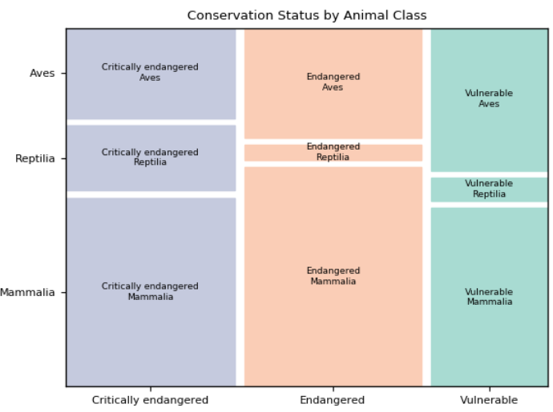

# Animal-Conservation-Project

This is a program created in Python 3 using mosaicplot, matplotlib, seaborn, pandas, json and re libraries.  It reads in a json file and creates a mosaic visualization of the data showing the conservation status of various animals by their class.

https://repl.it/@chaudhryna/310-L11-Cleaning-Data-Mosaic-Plot

